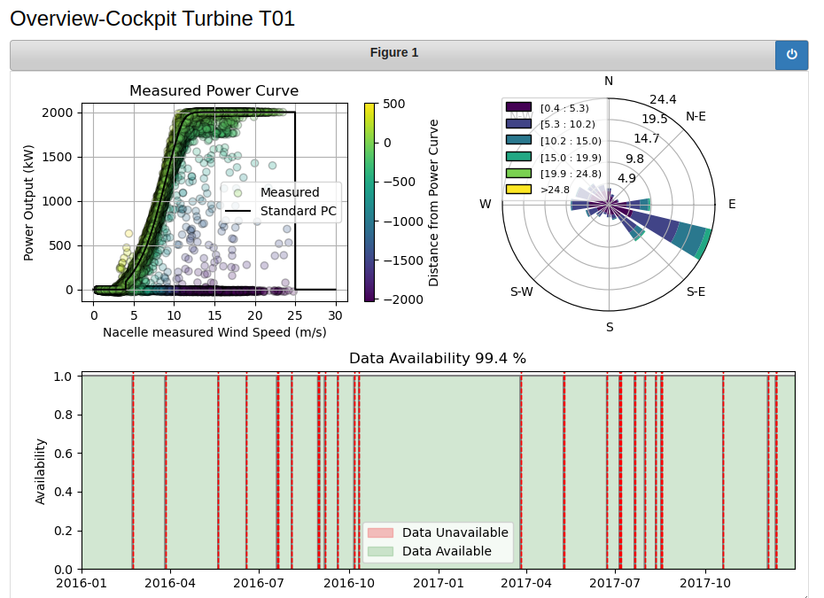
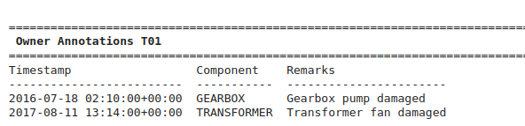

# Wind_Turbine_SCADA_open_data

### Repository of openly available wind turbine SCADA datasets with high-level descriptions, reusable data loaders for convenient CSV import, and a platform for documenting insights related to data quality and malfunctions.

For questions and feedback, plese reach out to: mail@simonletzgus.eu.

## Table of open source wind turbine SCADA data sets:

|ID| Dataset                                                                                                        | .jpynb                                      |Loc        |Met- mast   |Trb #   |Var #   |Logs &check;/&cross;  |Labels &check;/&cross;           |&Delta;T   |&sum;T       |Ref | Remarks/License  |
|--|----------------------------------------------------------------------------------------------------------------|---------------------------------------------|-          |-              |-      |-      |-      |-                     |-          |-             | -  |-                 |
|1 | [EDP Open Data](https://www.edp.com/en/innovation/open-data/data)                                              | [here](.notebooks/edp_open_data.ipynb)      | ESP (on)  |&check;        | 5     |~80    | &check;     | &check;[1](#fn1)| 10m     | 2y |  - |  T09 removed from dataset |
|2 | [Winji Gearbox Challenge](https://www.wedowind.ch/blog/winji-register)                                         | &cross;                                     | ?         |?              | 5     |~20    | &check;     | &check;[2](#fn2)| 10m     | 3y |  - |  register & consent from WinJi | 
|3 | [Kelmarsh Farm](https://zenodo.org/record/5841834#.YgpBQ_so-V7)                                                | [here](.notebooks/kelmarsh_open_data.ipynb) | UK (on)   |&cross;        | 6     |~99     | &check;     | &cross;                    | 10m[3](#fn3)     | 5y|  - | [farm info](https://www.thewindpower.net/windfarm_en_17507_kelmarsh.php)|
|4 | [Penmanshiel Farm](https://zenodo.org/record/5946808#.YgpAmvso-V5)                                             | &cross;                                     | UK (on)   |&cross;        |14     |>150     | &check;     | &cross;                   | 10m[3](#fn3)     | 5y|  - | [farm info](https://www.thewindpower.net/windfarm_en_23147_penmanshiel.php) |
|5 | [Ørsted Anholt Offshore](https://orsted.com/en/our-business/offshore-wind/offshore-operational-data)           | &cross;                                     | DEN (off) |(&check;)[4](#fn4)       | 111  | ?     | ?     | ?                    | 10m     | 2y           |  - | application/NDA; [farm info](https://www.thewindpower.net/windfarm_en_10687_anholt.php) |
|6 | [Ørsted Westermost Rough](https://orsted.com/en/our-business/offshore-wind/offshore-operational-data)          | &cross;                                     | UK (off)  |(&check;)[4](#fn4)       | 35   | ?     | ?     | ?                    | 10m     | 2y           |  - | application/NDA; [farm info](https://www.thewindpower.net/windfarm_en_21826_westermost-rough.php) | 
|7a| ["CAREtoCompare" Windfarm B](https://data.niaid.nih.gov/resources?id=zenodo_10958774)                          | &cross;                                     | GER (off) |?       | 9    |  64| ?     | &check;                    | 10m     | 2y           |  - | normalized for anonymization |
|7b| ["CAREtoCompare" Windfarm C](https://data.niaid.nih.gov/resources?id=zenodo_10958774)                          | &cross;                                     | GER (off) |?       | 22   | 238| ?     | &check;                  | 10m     | 2y          |  - | normalized for anonymization |
|8 | [Fuhrländer Farm](https://github.com/alecuba16/fuhrlander)                                                     | &cross;                                     | ? (on)    |&cross;        | 5   | 312| &check;     | &cross;                  | 5m     | 3y          |  [[2]](#ref2) | Eclipse Public License v2.0 |
|9a | [DSforWind Windfarm 1a](https://zenodo.org/records/5516552)                                                   | &cross;                                     | ? (on)    |&check;[6](#fn6)| 4     | 7     | &cross;     | &cross;      | 10m     | 1y           |  - | - |
|9b | [DSforWind Windfarm1b](https://zenodo.org/records/5516552)                                                    | &cross;                                     | ? (off)   |&check;[6](#fn6)| 2     | 7     | &cross;     | &cross;      | 10m     | 1y           |  - | - | 
|9c | [DSforWind Windfarm 2a](https://zenodo.org/records/5516554)                                                   | &cross;                                     | ? (on)    |&check;[6](#fn6)| 2     | 7     | &cross;     | &cross;      | 10m     | 1y           |  - | - | 
|9d | [DSforWind Windfarm 2b](https://zenodo.org/records/5516554)                                                   | &cross;                                     | ? (off)   |&check;[6](#fn6)| 2     | 7     | &cross;     | &cross;      | 10m     | 1y           |  - | - | 
|10 | [PCWG Data Sets](https://pcwg.org/)                                                                           | &cross;                                     | ? (on)    |&check;        | 3     | 1     | &cross;     | &cross;                   | 10m         | 1y       |  - | - |
|11 | [Norrekaer Windfarm](https://data.dtu.dk/articles/dataset/SCADA_data_from_Norre_m2_wind_farm/19076756)        | &cross;                                     | DK (on)   |&check;        | 41     | 3     | &cross;     | &cross;                   | 10m         | 1.5y       |  [[3]](#ref3) | [farm info](https://gitlab.windenergy.dtu.dk/fair-data/winddata-revamp/winddata-documentation/-/blob/master/norre_m2.md) |
|11 | [Delabole Windfarm](https://data.dtu.dk/articles/dataset/SCADA_data_from_Norre_m2_wind_farm/19076756)         | &cross;                                     | UK (on)   |&check;        | 10     | 1     | &cross;     | &cross;                   | 10m         | 1y       |  [[4]](#ref4) | [farm info](https://gitlab.windenergy.dtu.dk/fair-data/winddata-revamp/winddata-documentation/-/blob/master/delabole.md) |
|12| [Dundalk IoT](https://data.mendeley.com/datasets/tm988rs48k/2)                                                 | &cross;                                     | IRE (on)  |&cross;        | 1     | 20   | &cross;     | &check;[7](#fn7)| 10m     | 14y          |  - | urban terrain |
|13| [Kaggle Wind Turbine](https://www.kaggle.com/berkerisen/wind-turbine-scada-dataset)                            | &cross;                                     | TUR (on)  |&cross;        | 1     | 4     | &cross;     | &cross;                    | 10m     | 1y|  - | - | 
|14| [Small São Paulo](https://zenodo.org/records/7348454)                                                          | &cross;                                     | BRZ (on)  |&cross;        | 1     | ~40   | &cross;     | &cross;                        | 1m      | 5y|  - | small, urban turbine | 
|15| [Björkö Wind Turbine](https://zenodo.org/records/8213270)                                                      | &cross;                                     | SWE (on)  |&cross;        | 1     | 68   | &cross;     | &cross;                        | 1s      | 1y|  - | small; [turbine info](https://www.chalmers.se/en/departments/e2/resources-and-collaboration/chalmers-wind-turbine/)| 
|16| [IET-OST Turbine](https://zenodo.org/records/8192149)                                                          | &cross;                                     | SUI (on)  |&cross;        | 1     | 15   | &cross;     | &cross;                        | 1s      | 1.5y|  - | small; [turbine info](https://www.chalmers.se/en/departments/e2/resources-and-collaboration/chalmers-wind-turbine/)| 
|17| [Pedra do Sal Wind Farm](https://zenodo.org/records/1475197)                                                   | &cross;                                     | BRZ (on)  |&check;        | 20     | ~40   | &cross;     | &cross;                        | 10m      | 1y |  - | [farm info](https://www.thewindpower.net/windfarm_en_15922_pedra-do-sal.php)| 
|18| [Beberibe Wind Farm](https://zenodo.org/records/1475197)                                                       | &cross;                                     | BRZ (on)  |&check;        | 32     | ~40   | &cross;     | &cross;                        | 10m      | 1y |  - | [farm info](https://www.thewindpower.net/windfarm_en_7032_beberibe.php)| 
|19| [SMARTEOLE Wind Farm](https://zenodo.org/records/7342466)                                                      | &cross;                                     | FRA (on)  |&check;        | 7     | ~40   | &check;     | &cross;                        | 1m      | 4m |  [[5]](#ref5) | wake steering; [farm info](https://www.thewindpower.net/windfarm_de_3987_sole-du-moulin-vieux.php)| 
|98| [Engie La Haute Borne](https://opendata-renewables.engie.com/)                                                 | &cross;                                     | FR (on)   |&cross;        | 4     |~80    | &cross;     | &cross;                    | 10m     | 8y| -  |  offline; [farm info](https://www.thewindpower.net/windfarm_en_3354_la-haute-borne-vaudeville-le-haut.php) |
|99| [Levenmouth Turbine](https://pod.ore.catapult.org.uk/data-collection/ldt-turbine-scada-10m)                    | &cross;                                     | UK (near) |&check;        | 1     | >500  | &check;     | &cross;                        | 10m/1s| 3y|  - | not for free (~2000 £) |

&cross; = no / &check; = yes

1 Manual annotations of major failures or component replacements 

2 SCADA error log indicator

3 Statistics from wave buoy and ground-based LIDAR data.

4 Higher resolution on request

5 Environmental measures (except wind speed & TI) come from metmast 

6 Ground-based LIDAR

7 Gearbox replacement in 2018-2019 

## Notebooks - Data Loaders and Overview Plots:
The jupyter notebooks in the 'notebooks' folder contain a data loader for SCADA signals, logs, annotations as well as community annotations (see next sections). Table 1 indicates whether the respective dataset has already been added. Furthermore, they produce an overview over each dataset such as shown in the following image:

Also, for each turbine, there is an 'Overview Cockpit' with a power curve plot, a wind rose and the data avilability over time. An example is shown here:

Lastly, operator annotations are listed, if they are part of the dataset. See e.g. for T01 of the edp data set:

To run the notebooks yourself, please add the respective .csv-files to the data folder.

## Comunity Annotations:
We want to enable researchers to build upon the findings of others who were previously working with the dataset. For every dataset, we have set up a [community-annotation folder](./communiy_annotations), containing simple CSV's to collect data quality or malfunction related observations. They contain the following columns:

- annot_id: unique annotation identifies (running ascending number) 
- turbine_id: which turbine of the respective dataset is affected?
- signal: which signal exhibits the respective observation?
- time_start / time_stop: during which time is the observation present?
- related_log_message (optional): is there a SCADA log message that coincides with the observation?
- remarks: describe your observation in a few words.

The respective notebooks automatically load, read and display the respective malfuncitons. See e.g. this example from T01 of the edp-dataset:

## How to contribute:
We welcome contributions to expand the collection of open datasets in this repository as well as community annotations. If you have an open dataset you'd like to add, please feel free to submit a new pull request. We appreciate all contributions that help expand the collection of open datasets available in this repository. If you have any questions or need assistance, please don't hesitate to open a new issue.

## References:
Many of the above listed datasets are described and analysed in [[1]](#ref1).

[1]
[Effenberger, Nina, and Nicole Ludwig. "A collection and categorization of open‐source wind and wind power datasets." Wind Energy 25.10 (2022): 1659-1683.](https://onlinelibrary.wiley.com/doi/full/10.1002/we.2766)

[2]
[Marti-Puig, P., Blanco-M., A., Cusidó, J. et al. Wind turbine database for intelligent operation and maintenance strategies. Sci Data 11, 255 (2024).](https://www.nature.com/articles/s41597-024-03067-9)

[3]
[Hansen, Kurt Schaldemose; Vasiljevic, Nikola; Sørensen, Steen Arne (2022). SCADA data from Norre_m2 wind farm. Technical University of Denmark. Dataset.] (https://doi.org/10.11583/DTU.19076756.v1)

[4]
[Hansen, Kurt Schaldemose (2021). Scada data from Delabole wind farm. Technical University of Denmark. Dataset.] (https://doi.org/10.11583/DTU.14077004)

[5]
[Simley, E., Fleming, P., Girard, N., Alloin, L., Godefroy, E., and Duc, T.: Results from a wake-steering experiment at a commercial wind plant: investigating the wind speed dependence of wake-steering performance, Wind Energ. Sci., 6, 1427–1453, 2021.](https://doi.org/10.5194/wes-6-1427-2021)